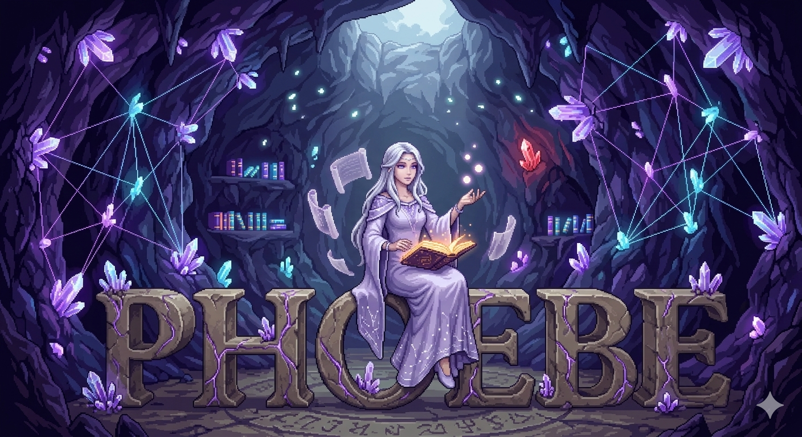

<p align="center">
  
</p>

<h1 align="center">Phoebe</h1>

<p align="center">
  <strong>Multimodal Knowledge Engine for LLMs</strong><br>
  An AI agent that builds persistent knowledge graphs from real sources, because LLMs know facts but forget <em>where</em> they learned them and <em>when</em> they changed.
</p>

<p align="center">
  <a href="LICENSE"></a>
  <a href="https://www.python.org/downloads/"></a>
  <a href="https://modelcontextprotocol.io"></a>
  <a href="https://ko-fi.com/rezraa"></a>
</p>

---

## The Problem

LLMs don't have a knowledge **retrieval** problem, they have a knowledge **provenance** problem. Claude knows what PEP 703 is. But when asked *"is free-threaded Python still experimental in 3.14?"*, it states outdated information because its training data predates the change. No sources cited. No way to verify. No way to know when the answer went stale.

## The Solution

Phoebe is an **AI agent** that builds and maintains a persistent knowledge graph (a **tome**) backed by an embedded graph database. She doesn't store files — she stores **memories of where she saw things and what they meant**, with source references, confidence scores, and causal chains.

When her tome is empty, she learns: searches the web, reads authoritative primary sources, and stores structured memories with full provenance. When her tome has answers, she recalls them instantly with source citations. The tome grows with every interaction. What she learns once, she knows forever.

Named after **Phoebe**, titan goddess of the oracle.

## Research Results

Controlled A/B test: 7 factual questions about Python's GIL removal (PEP 703). Vanilla Claude vs Claude + Phoebe agent with tome. All answers scored against ground truth.

| Run | Tome State | Duration | Score | Sources Cited | Key Finding |
|-----|-----------|----------|-------|---------------|-------------|
| Vanilla | N/A | 69s | 19/28 (67.9%) | 0 | **Wrong on Q6** (said "still experimental") |
| Run 1 | Empty → learned | 202s | 28/28 (100%) | 14 URLs | Full learning loop from primary sources |
| Run 4 | Populated (BM25) | **26s** | 28/28 (100%) | 3-4/question | **Instant recall, 7.8x faster** |

**Key findings:**
- **+32.1% accuracy uplift** (67.9% → 100%) on factual knowledge retrieval
- **1 wrong answer prevented**: Phoebe fetched PEP 779 and knew free-threading moved to "officially supported" in Python 3.14
- **7.8x faster on repeat queries**: 202s → 26s once the tome is populated
- **14 source citations** vs zero — every claim traceable to an authoritative document
- **Tome compounds value**: each run enriches the graph, answers get richer over time

Full findings: [`tests/benchmarks/findings/RESEARCH_FINDINGS.md`](tests/benchmarks/findings/RESEARCH_FINDINGS.md)

## Architecture

```
Claude Code (top-level LLM) → invokes /phoebe agent
  └─ Phoebe Agent (reasoning via persona + skill instructions)
       └─ Phoebe MCP Tools (graph CRUD + BM25 search)
            └─ Kuzu Embedded Graph Database (the tome)
                 ├─ memories (facts with provenance)
                 ├─ sources (where she learned them)
                 ├─ entities (what they're about)
                 └─ milestones (when they happened)
```

**Tools are hands, the LLM is the brain.** Tools do graph reads/writes and BM25 search. The agent decides what to learn, what contradicts, what to remember, and how to answer.

### MCP Tools

| Tool | Purpose |
|------|---------|
| `recall` | BM25 full-text search over tome memories |
| `remember` | Store a new memory with source URI, entities, confidence |
| `brief` | Generate a context brief for a project/topic |
| `trace` | Walk causal chains — why did this happen? what did it cause? |
| `blast_radius` | What depends on this entity? Impact analysis |
| `who_knows` | Who has the most expertise on a topic? |
| `stats` | Tome statistics and stale source report |

### The Tome

A **tome** is an embedded Kuzu graph database file. It contains:

| Table | Purpose |
|-------|---------|
| `memories` | What Phoebe learned — facts with confidence, status, outcome |
| `sources` | Where she learned it — URIs, staleness tracking, last crawled |
| `entities` | What it's about — people, systems, services, patterns, decisions |
| `milestones` | When it happened — sprints, releases, incidents |

15 relationship types connect them: `caused_by`, `supersedes`, `contradicts`, `corroborates`, `extracted_from`, `about`, `decided_by`, `affects`, `depends_on`, `owns`, and more. Full-text search via Kuzu's native BM25 FTS extension.

## Quick Start

### Install

```bash
git clone https://github.com/rezraa/phoebe.git
cd phoebe
python3 -m venv .venv && source .venv/bin/activate
pip install -e ".[dev]"
```

### Configure with Claude Code

The repo includes `.mcp.json` for automatic detection. Update the paths:

```json
{
  "mcpServers": {
    "phoebe": {
      "command": "/path/to/phoebe/.venv/bin/python3",
      "args": ["-m", "phoebe.server"],
      "cwd": "/path/to/phoebe",
      "env": {
        "PYTHONPATH": "src",
        "PHOEBE_TOME": "/path/to/your/project.tome"
      }
    }
  }
}
```

### Use

```bash
# In Claude Code, invoke the agent:
/phoebe

# Ask anything:
"What decisions have we made about auth?"
"Why did we choose Postgres over Mongo?"
"What breaks if we change the payment service?"
```

First time: Phoebe searches, reads sources, builds the tome. After that: instant answers with source citations.

### Dashboard

```bash
./start.sh              # Starts the live graph visualizer
# Open http://127.0.0.1:8888
```

Watch the knowledge graph grow in real-time as Phoebe learns. Blue nodes = active memories. Red nodes = superseded (corrected). Purple nodes = entities. Green nodes = verified sources. Dashed red lines = contradiction edges.

## How It Works

1. **User asks a question**: "What happened with the GIL removal?"
2. **Phoebe recalls from tome**: BM25 search across all memories
3. **If tome has answers**: responds with source citations and confidence scores
4. **If tome is empty**: searches the web for authoritative primary sources, reads them, calls `remember` for each fact extracted, then answers from the newly stored memories
5. **Tome grows**: every fact learned is stored permanently. Next time, the answer is instant.

The agent never just answers from training data. It always checks the tome first, learns when needed, and remembers what it learns. The tome is the brain. The LLM is the reasoning. The tools are the hands.

## Project Structure

```
phoebe/
├── src/phoebe/
│   ├── server.py          # MCP server — 7 tools
│   ├── schema.py          # Graph schema — 4 tables, 15 edges, BM25 FTS
│   ├── models.py          # Data factories — make_memory, make_source, etc.
│   ├── tome.py            # Tome lifecycle — create, open, close, stats
│   ├── store.py           # Graph CRUD — all node/edge operations
│   ├── reasoning.py       # Graph traversals — causal chains, blast radius, expertise
│   └── dashboard/         # Live graph visualizer (FastAPI + WebSocket)
├── .claude/
│   ├── agents/phoebe.md   # Agent persona — The Oracle of Memory
│   └── skills/recall/     # Skill workflow — recall, learn, remember
├── tests/
│   ├── test_tome.py       # 20 core tests (schema, CRUD, edges, reasoning)
│   ├── test_ab_investigate.py  # Investigation + correction tests
│   └── benchmarks/        # A/B test infrastructure and findings
├── scripts/               # Demo and investigation scripts
├── start.sh               # Dashboard launcher
└── PLAN.md                # Architecture and roadmap
```

## Part of Othrys

Phoebe is one of seven Titans in the [Othrys](https://github.com/rezraa/othrys) summoning engine. Standalone, she's a knowledge engine for any project. Inside Othrys, her tome feeds context to every other Titan — Mnemos (algorithms), Coeus (architecture), Hyperion (security), Themis (testing), and Theia (design).

## Support

If Phoebe is useful to your work, consider [buying me a coffee](https://ko-fi.com/rezraa).

## Author

**Reza Malik** | [GitHub](https://github.com/rezraa) · [Ko-fi](https://ko-fi.com/rezraa)

## License

Copyright (c) 2026 Reza Malik. [Apache 2.0](LICENSE)
